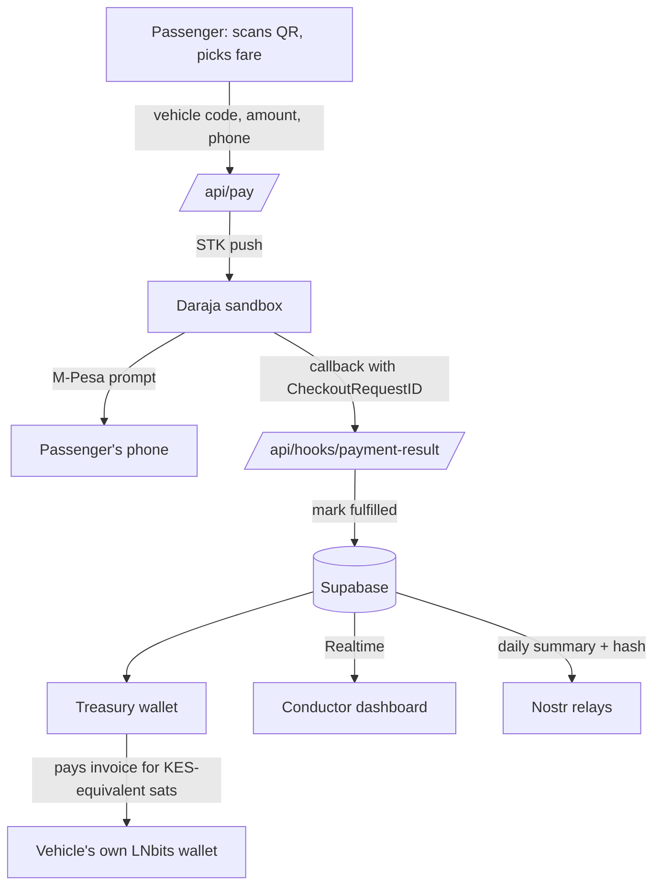

<div align="center">

# NauliSako

### Matatu fare payments, settled in Bitcoin Lightning

Pay with ordinary M-Pesa. Fares settle into the vehicle's own segregated Lightning wallet, conductors verify on a live dashboard, and owners see fleet-wide totals and forecasts.

<br />


<br />

[The Problem](#the-problem) &nbsp;|&nbsp; [The Solution](#the-solution) &nbsp;|&nbsp; [Why Lightning and Why Bitcoin](#why-lightning-and-why-bitcoin) &nbsp;|&nbsp; [How It Works](#how-it-works) &nbsp;|&nbsp; [Screenshots](#screenshots) &nbsp;|&nbsp; [Security](#security-model) &nbsp;|&nbsp; [Setup](#local-setup) &nbsp;|&nbsp; [Status](#project-status)

</div>

<br />

---

## At a Glance

| | |
| :-- | :-- |
| **Passenger** | Scans a QR code on the vehicle and pays with M-Pesa from their own phone — no app, no new wallet |
| **Conductor** | Watches fares land on a live dashboard and verifies against a 3-character code, with no need to inspect anyone's phone |
| **Owner or SACCO** | Sees fares arrive in each vehicle's own segregated Lightning wallet, with fleet totals grouped Owner → Plate → Conductor, and can cash out sats to M-Pesa through a third-party provider |
| **Transparency** | A signed daily summary — total fares, total sats, and a hash of the day's transaction list — is published to Nostr per vehicle |

---

## The Problem

Paying a matatu fare by M-Pesa today usually means handing your phone, or at least its screen, to a stranger. The passenger sends the money, then shows the confirmation to the conductor, who checks it by eye against the fare.

| Issue | What happens |
| :-- | :-- |
| **Exposure** | The conductor sees the passenger's phone, and with it their balance, transaction history and contacts. Passengers seen carrying money or a valuable phone become easier targets for theft and social engineering, on the vehicle and after they get off. |
| **Friction** | Every payment needs manual confirmation, one passenger at a time, while the vehicle is loading or moving. This slows boarding and leads to queues, disputes and missed fares. |
| **Trust** | A message on a screen is easy to fake, and the conductor has no independent way to confirm that money actually arrived. Owners and SACCOs have no reliable per-vehicle record of what each matatu earned, let alone a forecast of what to expect tomorrow. |

---

## The Solution

Nauli Sacco removes the phone-showing step. The passenger pays from their own phone — scanning a QR code on the vehicle, entering the fare, and confirming a real M-Pesa STK prompt. The fare then appears on the conductor's live dashboard, driven by a verified payment callback rather than a screen shown by the passenger.

Under the hood, each matatu holds its own segregated Lightning wallet. When a fare is confirmed, a treasury wallet — pre-funded with sats — pays that vehicle's wallet the KES-equivalent amount, so the vehicle's balance grows in sats immediately. A signed daily summary per vehicle is published to Nostr, and owners can see fleet-wide totals grouped by owner, then plate, then conductor, with a simple next-day forecast.

---

## Why Lightning and Why Bitcoin

Nauli Sacco is not a payments app with Bitcoin attached. The design depends on properties ordinary payment rails don't give a matatu fleet — while being honest about what kind of custody is actually in play.

| Property | What it means for a matatu |
| :-- | :-- |
| **Segregated per-vehicle wallets** | Every matatu has its own Lightning wallet, hosted on our LNbits instance. Fares settle directly into it, with no shared till or paybill account between vehicles. These wallets are **custodial** — LNbits holds the keys — but each vehicle's funds are kept apart from every other vehicle's, which is the property that actually matters for a SACCO with many owners sharing one platform. |
| **Built for small, fast payments** | Lightning settles low-value payments in seconds, which suits fares of a few tens of shillings — far below what a typical on-chain Bitcoin transaction could sensibly handle. |
| **Open and borderless** | Bitcoin and Lightning are open protocols. A SACCO's balance isn't locked inside one company's proprietary ledger. |
| **Public, checkable record** | A signed daily summary per vehicle — total fares, total sats, and a hash of that day's transaction list — is published to Nostr, an open protocol with many independent relays. Anyone with the event data can verify it without asking Nauli Sacco's permission. |
| **Familiar for the passenger** | The passenger still pays with M-Pesa. There is no new wallet, no seed phrase and no learning curve. Bitcoin is the settlement layer underneath, not something they ever have to think about. |

---

## Who It Serves

<table>
  <tr>
    <td width="33%" valign="top">
      <h4>Passengers</h4>
      Pay a fare without handing over their phone, so balances and contacts stay private. Scan the QR code on the vehicle, pick a fare, confirm on their own M-Pesa STK prompt.
    </td>
    <td width="33%" valign="top">
      <h4>Conductors</h4>
      See each fare arrive on a live dashboard scoped to their vehicle, without inspecting passengers' phones. A quick-check box matches a 3-character code the passenger is shown against the live list, and a tap marks it verified.
    </td>
    <td width="33%" valign="top">
      <h4>SACCOs and Owners</h4>
      See fares grouped Owner → Plate → Conductor, with today's totals in KES and sats per vehicle. A simple forecast projects tomorrow's likely hourly earnings from recent history, and owners can cash out a vehicle's sats to M-Pesa by paying a Lightning invoice from a provider like Tando or bitcoin.co.ke.
    </td>
  </tr>
</table>

---

## How It Works



| Step | Stage | Description |
| :-: | :-- | :-- |
| 1 | **Initiate** | The passenger scans a QR code on the vehicle, opening `/pay/<vehicleCode>`. |
| 2 | **Pay** | They pick a fare and enter their M-Pesa number. The app calls Daraja's sandbox STK push endpoint and stores the real `CheckoutRequestID` Daraja returns — never a locally generated placeholder. |
| 3 | **Confirm** | Daraja sends a signed callback once the passenger enters their M-Pesa PIN. The server verifies it and marks the transaction fulfilled, recording only a masked phone number and its last 3 digits. |
| 4 | **Settle** | A treasury wallet, pre-funded with sats, pays an invoice issued by the vehicle's own LNbits wallet for the KES-equivalent amount. The treasury is the market maker standing between M-Pesa shillings and Lightning sats — it is not a direct KES-to-BTC conversion. |
| 5 | **Verify** | `/dashboard/<vehicleCode>` updates live through Supabase Realtime. The conductor matches the passenger's 3-character code against the new row and taps "Verified." |
| 6 | **Report** | Once a day, a signed summary per vehicle — total fares, total sats, and a hash of the transaction list — publishes to Nostr relays. |
| 7 | **Review and cash out** | `/sacco/<saccoId>` shows fares grouped Owner → Plate → Conductor, with a simple next-day forecast. An owner can cash out a vehicle's sats by pasting a Lightning invoice or address from a provider like Tando or bitcoin.co.ke, which the vehicle's wallet pays directly. |

---

## Screenshots


---

## Security Model

| Concern | How it is handled |
| :-- | :-- |
| **M-Pesa PIN** | Entered only on Safaricom's own STK prompt on the passenger's phone. Nauli Sacco never displays a PIN field and never receives or stores a PIN. |
| **Payment authenticity** | The server tracks Daraja's real `CheckoutRequestID` for every request and only updates a transaction that is still `processing`, so a repeated or late callback can't double-apply. A manual STK-query fallback exists for when the sandbox callback doesn't arrive. |
| **Passenger privacy** | Only a masked phone number and its last 3 digits are stored — never the full number — which is what makes it safe to stream transaction rows to the browser over Supabase Realtime in the first place. |
| **Conductor and owner access** | There is no full account system yet. `/sacco`, `/analytics`, and the payout screen are guarded by a single shared PIN (`DEMO_ADMIN_PIN`) stored in a cookie. **This is a lightweight gate for a demo, not real authentication**, and the README says so plainly rather than overstating it. |
| **Demo data** | Seeded transactions used to populate dashboards and forecasts are tagged `source = 'seed'` and excluded from the live conductor list, so the real-time demo stays clean. |
| **Privileged keys** | The Supabase service role key, Daraja credentials, and LNbits admin keys exist only in server code (`app/api/**`, `lib/server/**`) and are never imported into a client component. The browser only ever uses the Supabase anon key, scoped by Row Level Security. |
| **Funds custody** | Each vehicle has its own LNbits wallet, so one vehicle's funds are never pooled with another's — but the wallets are custodial, held on a hosted LNbits instance, not self-custodied by the owner. This is stated as "segregated per-vehicle wallets," not "non-custodial," everywhere in this project. |
| **Off-ramp** | Cashing out is a payout, not a withdrawal link: the vehicle's wallet pays a BOLT11 invoice or Lightning address the owner supplies from their own provider (e.g. Tando, bitcoin.co.ke). Nauli Sacco does not integrate with either provider's API and never pulls funds on its own. |
| **Input handling** | Phone numbers are normalized server-side (`07`, `01`, and `254` formats are all accepted) before reaching Daraja. |

> [!WARNING]
> Never commit `.env*` files. They're listed in `.gitignore`; verify this before every push.

---

## Technology

| Layer | Technology | Purpose |
| :-- | :-- | :-- |
| Application | Next.js 14 (App Router), TypeScript, Tailwind | Passenger PWA, conductor dashboard, SACCO view, API routes |
| Data | Supabase (Postgres and Realtime) | SACCOs, owners, vehicles, transactions, payouts, live dashboard feed |
| Payments | Safaricom Daraja (sandbox) | M-Pesa STK push, collection, and status callbacks |
| Custody | LNbits | A treasury wallet plus one segregated, custodial wallet per vehicle |
| Forecasting | Statistical model (weekday × hour averages), optional Claude narration | Next-day earnings projection per vehicle — not a trained model |
| Transparency | Nostr | Signed daily summary event per vehicle, with a hash of that day's transactions |
| Off-ramp | Manual payout to Tando / bitcoin.co.ke | Owner-supplied BOLT11 invoice or Lightning address, paid directly from the vehicle's wallet |

<details>
<summary><strong>Repository structure</strong></summary>

<br />

```
app/
  page.tsx                              Landing: enter vehicle code, links to views
  pay/[vehicleCode]/page.tsx            Passenger PWA
  pay/[vehicleCode]/status/[txId]/page.tsx   Waiting → success/fail (Realtime)
  dashboard/[vehicleCode]/page.tsx      Conductor live view + QR
  sacco/[saccoId]/page.tsx              Owner → Plate → Conductor totals
  sacco/[saccoId]/payout/page.tsx       Off-ramp: pay a BOLT11 invoice or Lightning address
  analytics/[saccoId]/page.tsx          Next-day forecast per vehicle
  api/
    pay/route.ts                        Passenger payment initiation (real Daraja STK push)
    hooks/payment-result/route.ts       Daraja status callback
    tx/[id]/route.ts                    Status polling for the PWA
    tx/[id]/query/route.ts              STK query fallback, for stalled sandbox callbacks
    tx/[id]/verify/route.ts             Conductor verification
    dev/simulate-callback/route.ts      Dev-only fallback for a stalled sandbox callback
    sacco/[saccoId]/summary/route.ts    Owner → Plate → Conductor totals
    analytics/[saccoId]/route.ts        Forecast data
    payout/route.ts                     Off-ramp payment
    nostr/publish/route.ts              Daily summary publish
lib/
  supabase-browser.ts                   Anon client
  server/supabase-admin.ts              Service-role client
  server/daraja.ts                      Token, STK push, STK query, callback parsing
  server/lnbits.ts                      Invoices, payments, balances, decoding
  server/treasury.ts                    settleTransaction(txId) — the treasury swap
  server/pricing.ts                     KES-to-sats conversion, with a fallback rate
  server/lnurl.ts                       Resolves a Lightning address for payout
  server/nostr.ts                       Builds and publishes the daily summary event
  server/forecast.ts                    Weekday × hour averages, peak hours, suggested shift
  phone.ts                              Kenyan phone normalization and masking
scripts/
  seed.ts                               Sacco, owners, vehicles, wallets, 30 days of history
  smoke.ts                              End-to-end check: pay → callback → settle
supabase/
  migrations/0001_init.sql              Full database schema
.env.example
README.md
```

</details>

---

## Environment Variables

| Variable | Used by | Notes |
| :-- | :-- | :-- |
| `APP_URL` | Server | The app's public base URL |
| `NEXT_PUBLIC_SUPABASE_URL` | Client and server | Supabase project URL |
| `NEXT_PUBLIC_SUPABASE_ANON_KEY` | Client | Supabase anon (public) key |
| `SUPABASE_SERVICE_ROLE_KEY` | Server only | Full-access key. Never expose to the browser |
| `DARAJA_BASE_URL` | Server only | `https://sandbox.safaricom.co.ke` during development |
| `DARAJA_CONSUMER_KEY` / `DARAJA_CONSUMER_SECRET` | Server only | Issued from the Daraja developer portal |
| `DARAJA_SHORTCODE` / `DARAJA_PASSKEY` | Server only | Sandbox test shortcode and passkey |
| `DARAJA_CALLBACK_BASE_URL` | Server only | Public HTTPS base (tunnel or deployed URL) that Daraja can reach |
| `DARAJA_CALLBACK_TOKEN` | Server only | Random string appended to and checked on the callback URL |
| `LNBITS_URL` | Server only | The LNbits instance hosting the treasury and vehicle wallets |
| `LNBITS_TREASURY_ADMIN_KEY` / `LNBITS_TREASURY_INVOICE_KEY` | Server only | Treasury wallet keys used to fund vehicle wallets |
| `BTC_KES_FALLBACK` | Server | KES-per-BTC rate used if a live price fetch fails |
| `DEMO_SATS_PER_KES` | Server | Optional override to keep the treasury float small during a demo |
| `NOSTR_SECRET_KEY_HEX` | Server only | Signs the daily summary events |
| `NOSTR_RELAYS` | Server | Comma-separated relay list |
| `ANTHROPIC_API_KEY` | Server, optional | Adds a short plain-English narration to the numeric forecast |
| `DEMO_ADMIN_PIN` | Server | Guards `/sacco`, `/analytics`, and the payout screen — a demo gate, not real authentication |

---

## Local Setup

**1. Install dependencies**

```bash
npm install
```

**2. Configure the environment.** Create `.env.local` with the variables above.

**3. Apply the database schema.** Run `supabase/migrations/0001_init.sql` in the Supabase SQL editor, then enable Realtime on the `transactions` table under Database, Replication.

**4. Set up LNbits.** On your LNbits instance, create the treasury wallet and fund it with test sats, then create or seed one wallet per vehicle (see `scripts/seed.ts`). Enable the LNURLp extension if you want vehicles to have an optional Lightning address.

**5. Seed demo data.**

```bash
npx tsx scripts/seed.ts
```

This creates a demo SACCO, owners, and vehicles, and backfills 30 days of realistic fare history for the analytics forecast.

**6. Start the app and expose it.** Run these in separate terminals.

```bash
npm run dev
cloudflared tunnel --url http://localhost:3000
```

**7. Register the Daraja callback.** In the Daraja sandbox app, set the callback URL to `<tunnel-url>/api/hooks/payment-result?token=<DARAJA_CALLBACK_TOKEN>`.

**8. Run the smoke test.**

```bash
npx tsx scripts/smoke.ts KAB123B 50 0708374149
```

This pays a fare through `/api/pay`, simulates the callback if the sandbox doesn't deliver one, and confirms the transaction reaches `settled` with the vehicle wallet balance increased.

---

## Project Status

Scope for the build, grouped by priority rather than claimed as finished — this is accurate as of the last update to this README, and should be revised once features are confirmed working end to end.

| Priority | Feature | Notes |
| :-- | :-- | :-- |
| P0 | Passenger payment via real Daraja sandbox STK push | Core demo path |
| P0 | Daraja callback handling, with STK-query and simulate fallbacks | Sandbox callbacks are unreliable; both fallbacks are kept available at all times, including on stage |
| P0 | Treasury settlement into the vehicle's own LNbits wallet | The treasury float is the real cost of the sandbox demo, since no real KES arrives |
| P0 | Live conductor dashboard via Supabase Realtime, with 3-character verification | |
| P0 | Sacco view: Owner → Plate → Conductor totals | |
| P1 | Next-day forecast, with optional Claude narration | Statistical averages, not a trained model |
| P1 | Off-ramp payout to Tando / bitcoin.co.ke via BOLT11 invoice or Lightning address | Owner-initiated; Nauli Sacco never pulls funds |
| P1 | Nostr daily summary per vehicle | Once per vehicle per day, not per transaction |
| Out of scope | USSD for feature phones, full login/auth, production Daraja | Deliberately deferred — see the build notes for reasoning |

> [!NOTE]
> `DEMO_ADMIN_PIN` guards a few screens for the demo. It is not an authentication system, and this README won't describe it as one.

---

## License

Nauli Sacco is open source under the [MIT License](LICENSE).

---

<div align="center">

Built for GirlCode.

</div>building-your-application/deploying) for more details.
